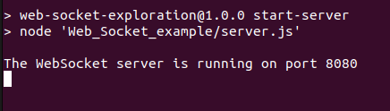
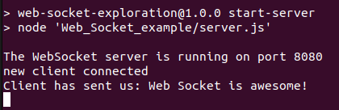

<a name="readme-top"></a>
<h1 align="center">Web Sockets, a nodeJS example.</h3>
<h2 align="Center">(<a href="https://github.com/danekf/web-socket-exploration">Return to main page</a>)</h2>  
<br>

<!--Table of Contents -->
<details>
  <Summary>Table of Contents</summary>
    <ul>
      <li><a href= "#Intro">Introduction</a></li>
      <li><a href= '#Using-server'>Using the server</a></li>
      <li><a href= '#Making-a-connection'>Making a connection</a></li>
      <li><a href= '#Roadmap'>Roadmap</a></li>
    </ul>
</details>

## Intro
<p>This section shows a simple NodeJS websocket server and client connection clone the repository. Before starting, run the install command to install all required dependencies</p>

```sh
npm install
```

<p align="right">(<a href="#readme-top">back to top</a>)</p>
<br>

## Using the server
<p>To start the server, run this command.</p>

```sh
npm run start-server
```

<p>Once the server has started, the console will give a message that the server is listening for a connection.</p>

<div align="center">
</img>
</div>

<p align="right">(<a href="#readme-top">back to top</a>)</p>
<br>

## Making a connection
<p>To make a simple connection, open the client.html file, found in the "Web_Socket_Example" folder after starting the server. </p>
<p>The client is configured to send a simple message of "Web socket is awesome" on connection. The server is the configured to simply display the content of what is sent by the client in the console.</p>

<div align = "center">
  </img>
</div>

<p align="right">(<a href="#readme-top">back to top</a>)</p>
<br>

## Roadmap
<ul>
<li>[ ]Implement a simple ability for the server to send data that will then be shown on the client website.</li>
<li>[ ]Implement a full chat client using <a href = "https://www.piesocket.com/docs/3.0/javascript-client">the piesocket walkthrough.</a></li>

</ul>

<p align="right">(<a href="#readme-top">back to top</a>)</p>
<br>